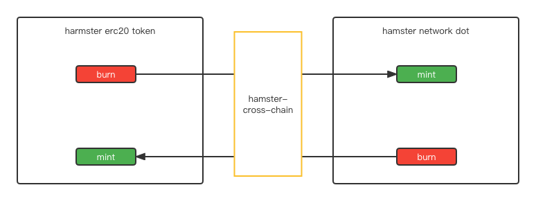

<div align=center>

</div>
<div align=center>


</div>


[github](https://github.com/hamster-shared/hamster-cross-chain-temporary): https://github.com/hamster-shared/hamster-cross-chain-temporary

hamster is a blockchain-based blockchain infrastructure service. Any computing device can easily access the Hamster network.

# Project Guidelines

## 1. Basic Introduction

### 1.1 Project Introduction

> hamster-cross-chain-temporary is a temporary tool that can convert hamster tokens on Ethereum with tokens in the hamster network。 It's temporary, experimental.

### 1.2 Contributing Guide

Hi! Thank you for choosing Hamster.

Hamster is a blockchain that providers' infrastructure service.

We are excited that you are interested in contributing to Hamster. Before submitting your contribution though, please make sure to take a moment and read through the following guidelines.

#### 1.2.1 Issue Guidelines

- Issues are exclusively for bug reports, feature requests and design-related topics. Other questions may be closed directly.

- Before submitting an issue, please check if similar problems have already been issued.

#### 1.2.2 Pull Request Guidelines

- Fork this repository to your own account. Do not create branches here.

- Commit info should be formatted as `[File Name]: Info about commit.` (e.g. `README.md: Fix xxx bug`)

- If your PR fixes a bug, please provide a description about the related bug.

- Merging a PR takes two maintainers: one approves the changes after reviewing, and then the other reviews and merges.

### 1.3 Version list

- main: 1.0.0 code, for test

## 2. Getting started

```
- node version > v17.4.0
- IDE recommendation: Sublime Text , WebStorm
```

### 2.1 server project

```bash

# install package dependency
$ yarn 

# start dev 
$ yarn start:dev

```

### 2.2 project config

config file is `.env` file. You can get view config item as blow.

| item  | description | default  | 
| --- | --- | --- | 
| WEB3_MNEMONIC |  Ethereum network mnemonic, don't share with other. |  |
| WEB3_WS_ENDPOINT | Ethereum websocket endpoint | wss://rinkeby.infura.io/ws/v3/bab2a1a435b04c07a488d847cf6788f7 | 
| WEB3_HTTP_ENDPOINT | Ethereum http endpoint  | https://rinkeby.infura.io/v3/bab2a1a435b04c07a488d847cf6788f7 | 
| HAMSTER_ENDPOINT ｜ hamster network endpoint | ws://127.0.0.1:9944 | 
| HAMSTER_ACCOUNT_ADDRESS | hamster network account address  | | 
| HAMSTER_ACCOUNT_SEED | hamster network account seed, must pair with HAMSTER_ACCOUNT_ADDRESS |
| CONTRACT_ADDRESS | Ethereum Hamster ERC20 contract address | 0x7079E71F29396c4DfC14eA1c33059A7efb398e2b | 

### 2.3 contract address:

| network |  contract address |
|---| --- |
|  rinkeby |  0x7079E71F29396c4DfC14eA1c33059A7efb398e2b  |


## 3. Technical selection

- nestjs: [NestJS](https://nestjs.com/) is a framework for building efficient, scalable Node.js web applications. It uses modern JavaScript, is built with TypeScript and combines elements of OOP (Object Oriented Programming), FP (Functional Programming), and FRP (Functional Reactive Programming).
- Web3js: web3.js is a collection of libraries that allow you to interact with a local or remote ethereum node using HTTP, IPC or WebSocket.


## 3. Project Architecture

### 3.1 Architecture Diagram




### 3.2 Project Layout

```       
.
├── doc                     some doc directory
├── src                     src dir
│   ├── config              configuration dir
│   ├── event               event module
│   ├── polkadot            polkadot module
│   └── web3                web3js module
└── test                    test directory

            

```

## 4. Features

- burning hamster erc20 token in Ethereum and mint hamster dot in hamster network
- burning hamster dot in hamster network and mint hamster erc20 token 
## 5. Knowledge base

### 5.1 Team blog

> https://github.com/hamster-shared
>


## 6. Contributors

Thank you for considering your contribution to hamster!

<a href="https://github.com/hamster-shared/hamster-cross-chain-temporary/graphs/contributors">
  
</a>

## 7. Commercial considerations

If you use this project for commercial purposes, please comply with the Apache2.0 agreement and retain the author's technical support statement.


